# ArchorKube, screen by screen

*What the app looks like before you install it. Every screenshot comes from a real sandbox tenant (one AKS cluster running demo apps), app version 0.4.6. The only edit: a cluster name containing a person's name was replaced by `sandbox-cluster`.*

*Cómo se ve la app antes de instalarla. Cada captura sale de un tenant sandbox real (un cluster AKS con apps de demo), versión 0.4.6. Único retoque: el nombre de un cluster que incluía el nombre de una persona se reemplazó por `sandbox-cluster`.*

- [Overview](#overview--portada)
- [Cost (FinOps)](#cost-finops--costo): [Rightsizing](#rightsizing) · [Idle](#idle--ociosos) · [Nodes](#nodes--nodos) · [Spend](#spend--gasto)
- [Reliability (SRE)](#reliability-sre--confiabilidad): [Outage risk](#outage-risk--riesgo-de-caída) · [Elasticity](#elasticity--elasticidad) · [Preventive](#preventive--preventiva) · [Errors](#critical-errors--errores-críticos) · [Bottlenecks](#bottlenecks--cuellos-de-botella) · [Control plane](#control-plane)
- [Governance](#governance--gobierno): [Compliance](#compliance--cumplimiento) · [Orphans](#orphans--huérfanos) · [Tiers](#tiers) · [Pending tiers](#pending-tiers--tiers-pendientes)
- [Guide](#guide--guía) · [Setup](#setup) · [Settings](#settings--configuración) · [Row actions](#row-actions--acciones-por-fila)

---

## Overview · Portada

One page that answers "how many problems do I have right now?": totals, estimated monthly waste, standard compliance, and a card per module with its findings and the time window it analyzes.

Una página que responde "¿cuántos problemas tengo ahora?": totales, desperdicio mensual estimado, cumplimiento del estándar y una tarjeta por módulo con sus hallazgos y la ventana de tiempo que analiza.

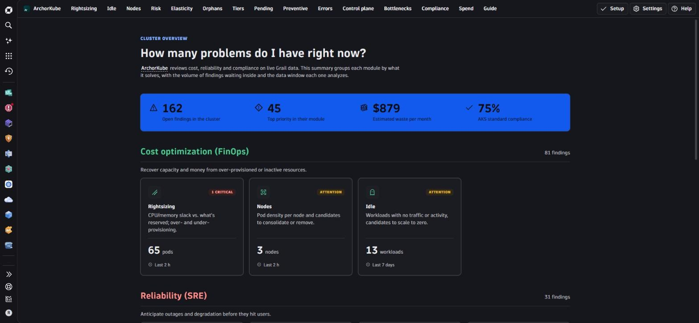
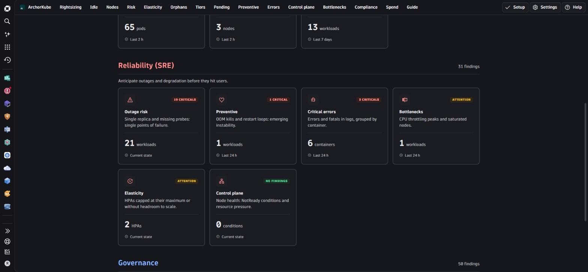
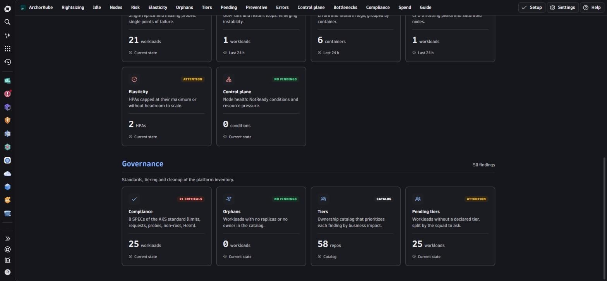

---

## Cost (FinOps) · Costo

### Rightsizing

CPU and memory reserved versus used, per pod, valued in USD per month. Throttling and under-requested pods come first, because those break things; over-provisioning comes after, because it only costs money.

CPU y memoria reservadas contra usadas, por pod, valorizadas en USD al mes. Primero el throttling y los requests por debajo del uso, que rompen cosas; después el sobreaprovisionamiento, que solo cuesta plata.

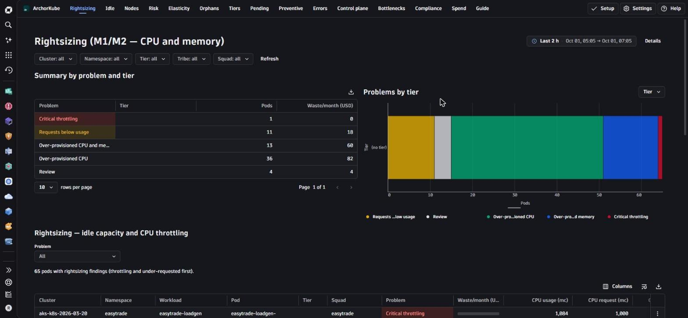

### Idle · Ociosos

Workloads with almost no CPU over 7 days, checked against APM traffic and restarts before calling them idle: "ruled out: has traffic" and "ruled out: unstable" keep efficient or broken services off the list.

Workloads casi sin CPU en 7 días, contrastados con el tráfico de APM y los reinicios antes de llamarlos ociosos: "descartado: tiene tráfico" y "descartado: inestable" sacan de la lista a los servicios eficientes o rotos.

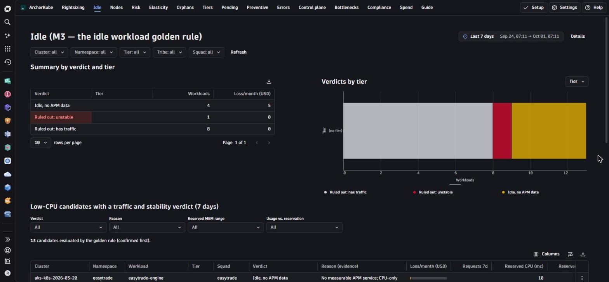

### Nodes · Nodos

Pod density and idle capacity per node, with the savings of consolidating or removing the underused ones.

Densidad de pods y capacidad ociosa por nodo, con el ahorro de consolidar o retirar los que sobran.

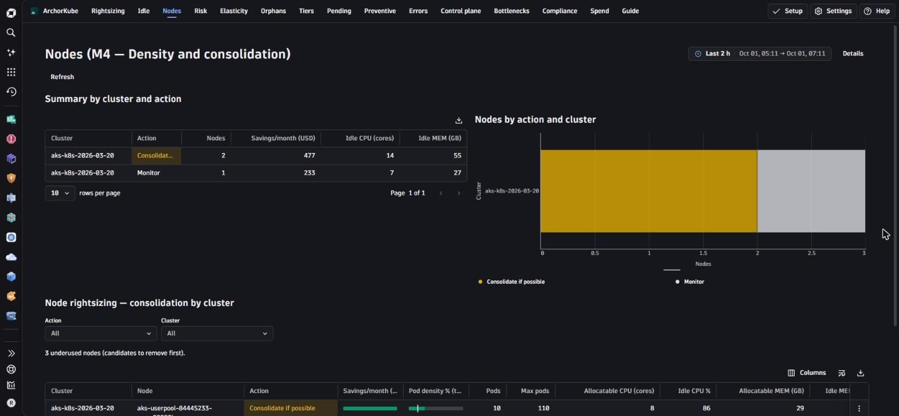

### Spend · Gasto

The machine inventory behind the clusters, prorated by node-day, priced from the cloud list price or your own price table.

El inventario de máquinas detrás de los clusters, prorrateado por nodo-día, con precio de lista de la nube o tu propia tabla de precios.

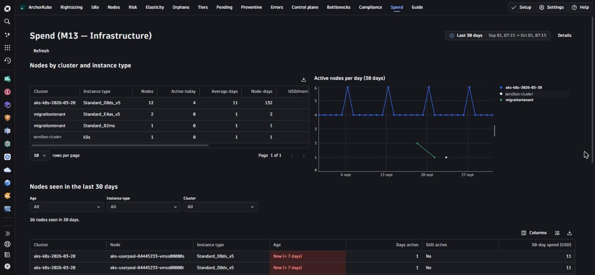

---

## Reliability (SRE) · Confiabilidad

### Outage risk · Riesgo de caída

Single replicas and missing probes, scored 0 to 3 per workload: the single points of failure.

Réplica única y probes faltantes, con un puntaje de 0 a 3 por workload: los puntos únicos de falla.

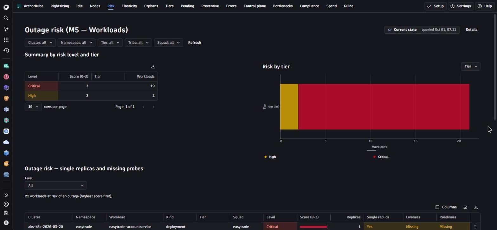

### Elasticity · Elasticidad

HPAs capped at their maximum or without headroom to scale.

HPAs topados en su máximo o sin margen para escalar.

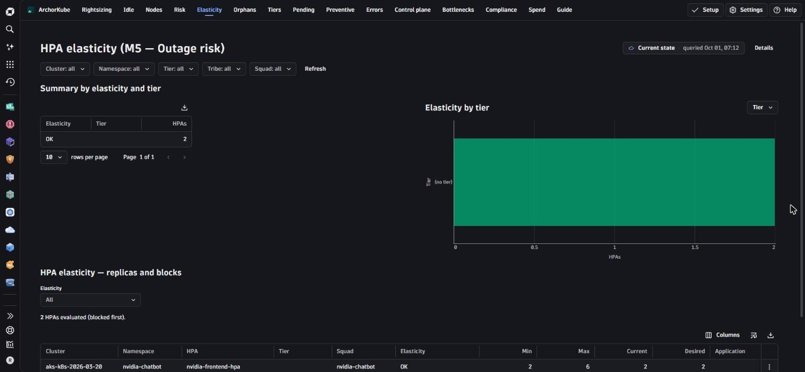

### Preventive · Preventiva

OOM kills and restart loops in the last 24 hours, before they turn into an incident.

OOM kills y reinicios en bucle de las últimas 24 horas, antes de que sean un incidente.

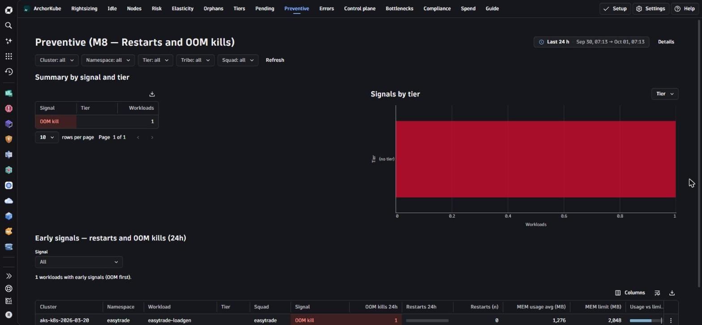

### Critical errors · Errores críticos

Errors and fatals from logs, grouped by container.

Errores y fatales de los logs, agrupados por contenedor.

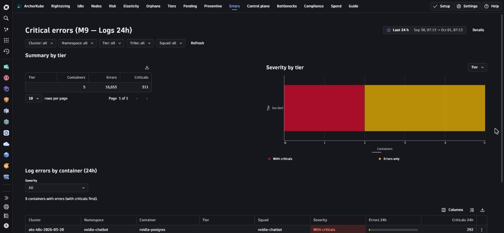

### Bottlenecks · Cuellos de botella

CPU throttling peaks per workload and saturated nodes.

Picos de throttling de CPU por workload y nodos saturados.

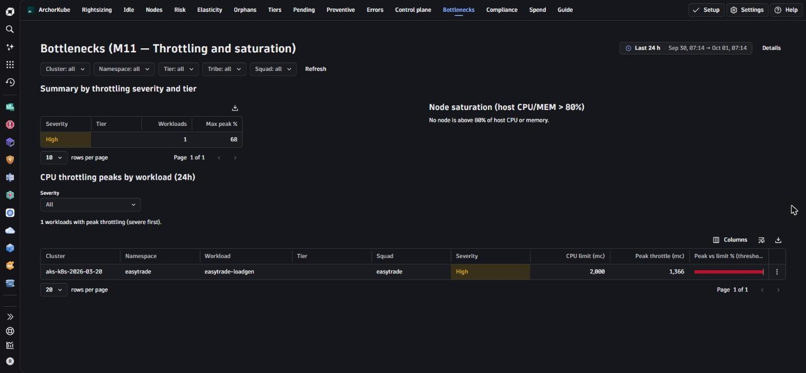

### Control plane

Node health: NotReady conditions and resource pressure. Empty means healthy.

Salud de los nodos: condiciones NotReady y presión de recursos. Vacío significa sano.

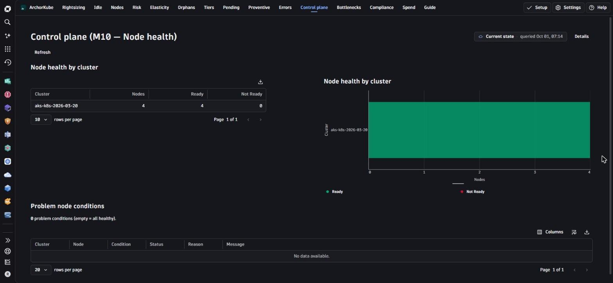

---

## Governance · Gobierno

### Compliance · Cumplimiento

The 8 SPECs of the AKS standard (limits, requests, probes, non-root, Helm), per spec and per workload.

Las 8 SPECs del estándar AKS (limits, requests, probes, non-root, Helm), por spec y por workload.

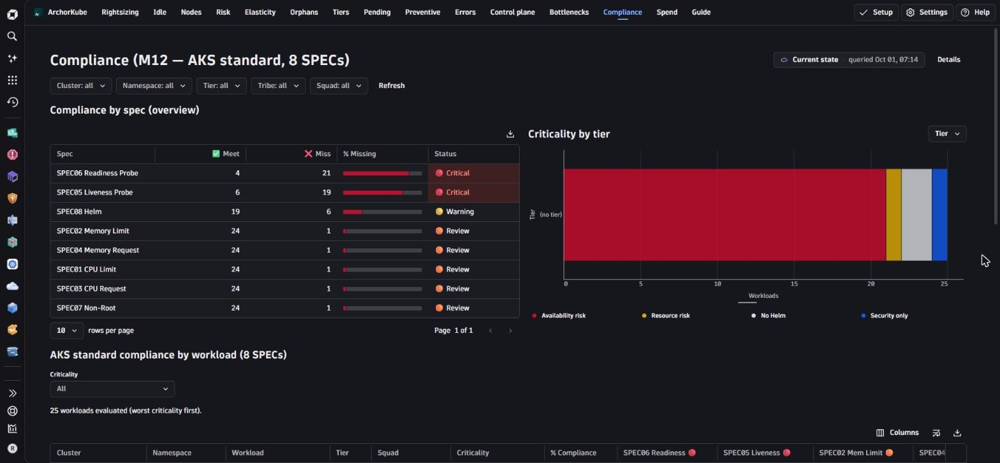

### Orphans · Huérfanos

Workloads scaled to zero and forgotten, or running with no owner. Empty in this sandbox: everything has an owner.

Workloads escalados a cero y olvidados, o corriendo sin dueño. Vacío en este sandbox: todo tiene dueño.

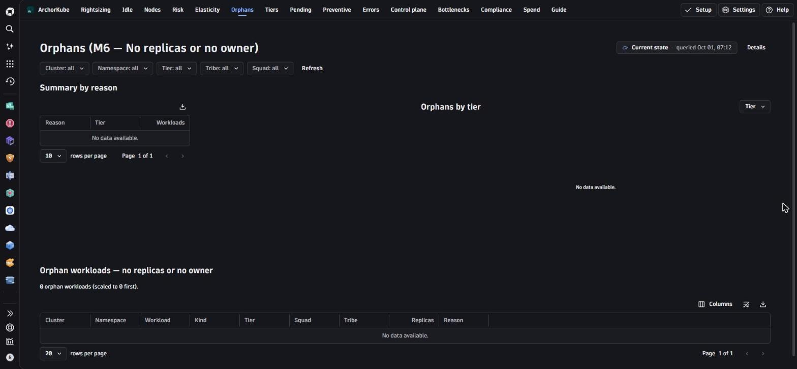

### Tiers

The ownership inventory: every workload with its squad, tier and domain, from whatever sources the tenant has (owner table, labels, namespace).

El inventario de propiedad: cada workload con su squad, tier y dominio, desde las fuentes que tenga el tenant (tabla de dueños, labels, namespace).

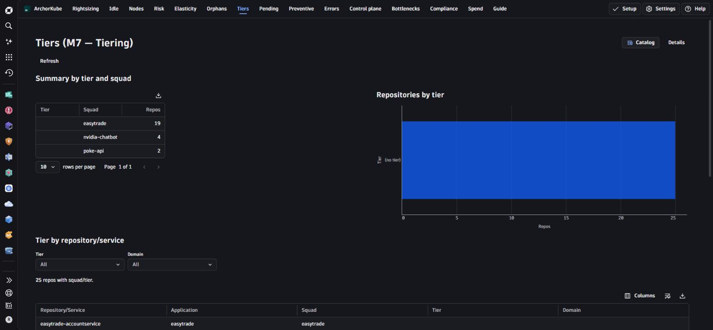

### Pending tiers · Tiers pendientes

Workloads without a declared tier, split by the squad to ask. It's the to-do list for prioritization.

Workloads sin tier declarado, repartidos por el squad al que hay que preguntarle. Es la lista de tareas de la priorización.

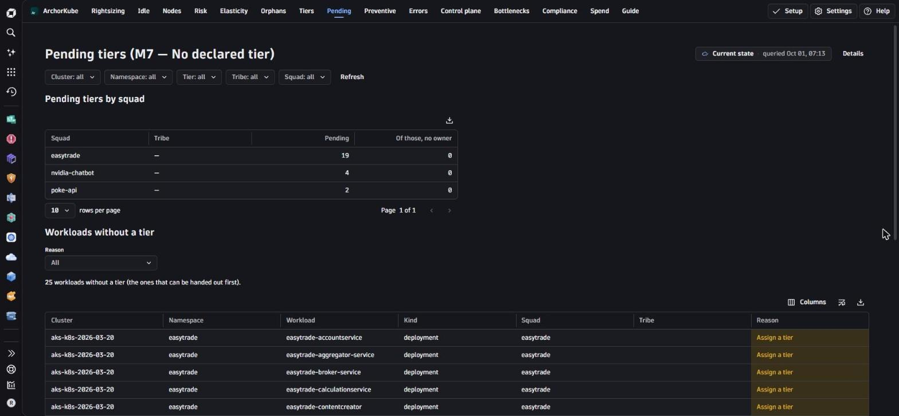

---

## Guide · Guía

The best-practice standard in plain words. Each rule says what it is, why it matters, what happens without it and how to comply, with the YAML to copy.

El estándar de buenas prácticas en palabras simples. Cada regla dice qué es, por qué importa, qué pasa sin ella y cómo cumplirla, con el YAML para copiar.

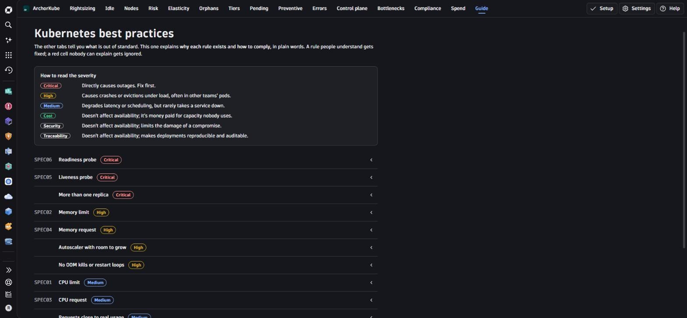
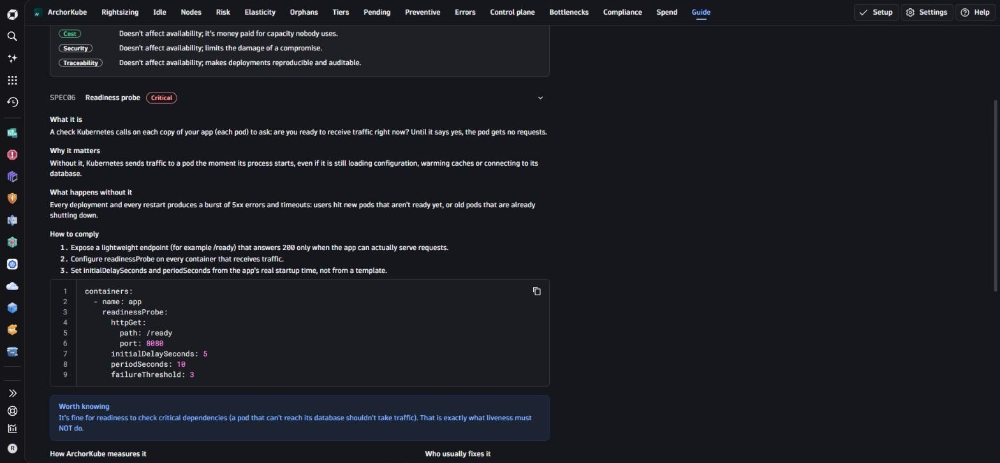

---

## Setup

What the app needs from your tenant, check by check, and which module stops working when something is missing. Coverage is drawn as colored bars, and whatever the tenant can't know (owners, tiers, prices) comes as a **To complete** table: download it pre-filled with your workloads, fill it in Excel and upload it.

Qué necesita la app de tu tenant, chequeo por chequeo, y qué módulo deja de funcionar cuando falta algo. Las coberturas se dibujan como barras con color, y lo que el tenant no puede saber (dueños, tiers, precios) viene como una tabla **Para completar**: descárgala precargada con tus workloads, complétala en Excel y súbela.

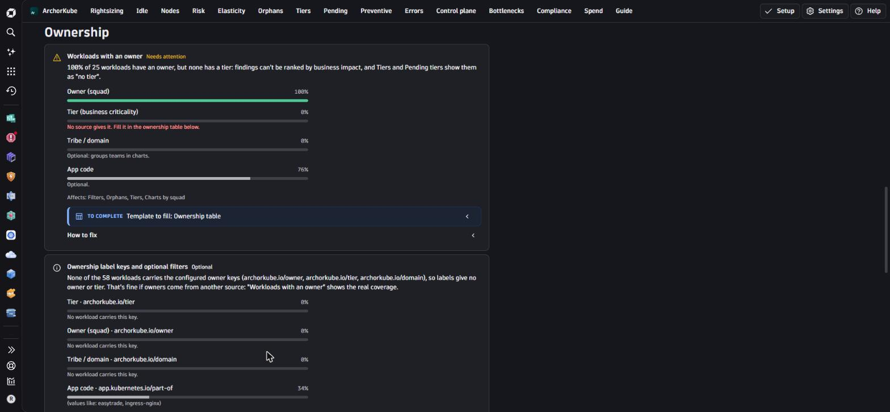
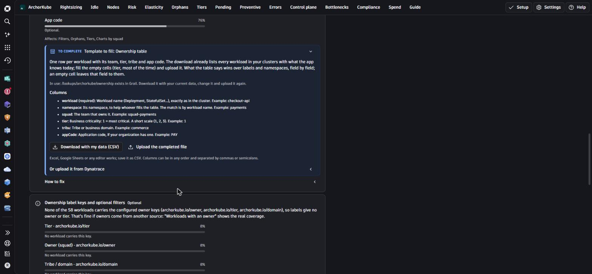

---

## Settings · Configuración

Language per user (English or Spanish) and how Kubernetes names leave Dynatrace when you send a finding to an outside AI: placeholders by default. Cluster names, squads, costs, URLs, IPs and emails never leave.

Idioma por usuario (inglés o español) y cómo salen los nombres de Kubernetes cuando envías un hallazgo a una IA externa: con marcadores por defecto. Nombres de cluster, squads, costos, URLs, IPs y emails nunca salen.

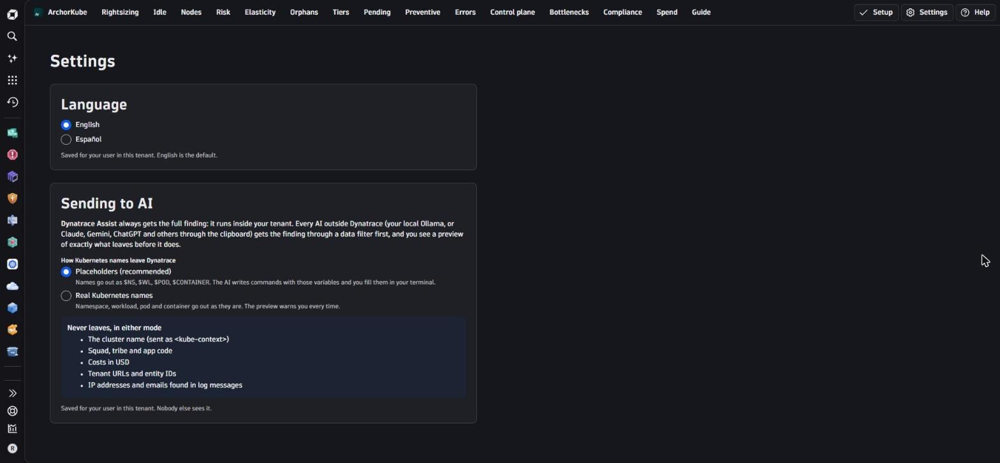

---

## Row actions · Acciones por fila

Every finding has a menu: *Why is this flagged?* (the rule behind it), *Ask Dynatrace Assist*, *Copy for another AI* (filtered, with a preview) and a link to the workload in Kubernetes.

Cada hallazgo tiene un menú: *¿Por qué se marca?* (la regla que lo explica), *Preguntar a Dynatrace Assist*, *Copiar para otra IA* (filtrado, con vista previa) y el enlace al workload en Kubernetes.

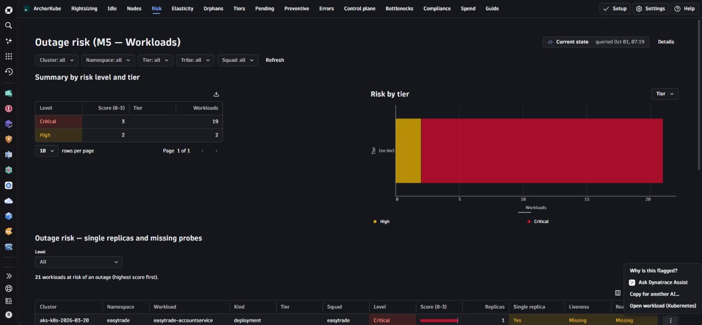

And the first time it opens, the app says what it is:

Y la primera vez que se abre, la app dice qué es:

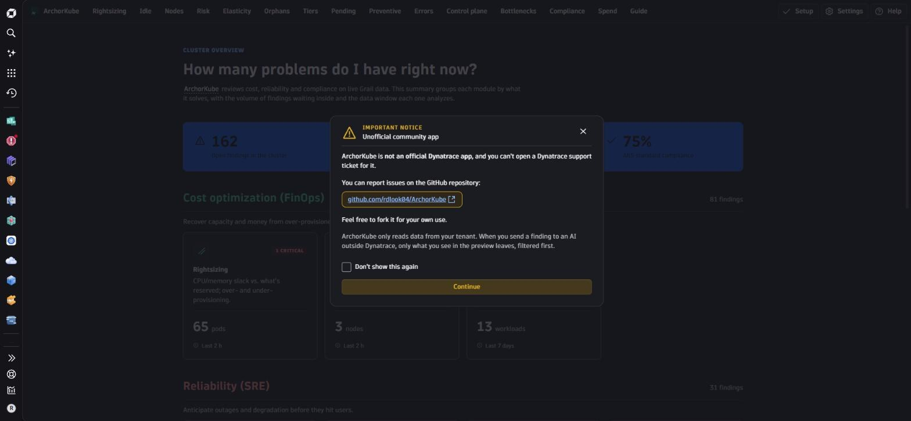
